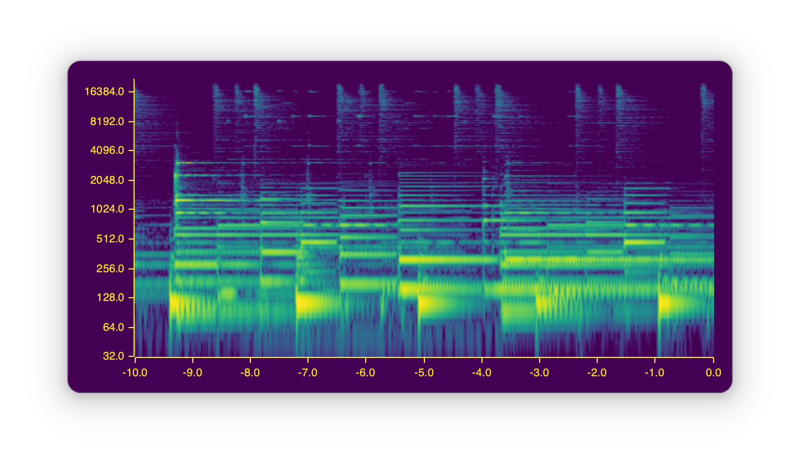

# spectrogram-rs

A simple cross-platform live scrolling spectrogram.

When used in combination with a loopback (like [blackhole](https://github.com/ExistentialAudio/BlackHole) on MacOS),
it can view sound from any application.

The program was designed for low latency from the start, meaning that the spectrogram really is live --
sounds should appear on the plot within one frame of hearing them.

It has also been optimized for low power usage;
[FFTW](https://www.fftw.org/) provides a very well-tuned DFT implementation,
and plotting is done with minimal updates to a retained buffer.
The end result is a program which uses less than 50% of a single CPU on my M1 mac when built in release mode.
These efficiency tweaks have the knock-on benefit of very smooth scrolling with no stuttering at all window sizes.

Hann windowing and input padding are used to produce a high-quality Fourier Transform,
and the resulting frequency bins are resampled with cosine interpolation to produce a more readable log-frequency scaled output.
This makes it easy to see details across the human range of hearing.

Inputs are discovered using [cpal](https://docs.rs/cpal/latest/cpal/),
and you can seamlessly switch between inputs at runtime.

Thanks to [colorous](https://docs.rs/colorous/latest/colorous/),
Matplotlib's diverse selection of gradient color schemes is available to choose from.

